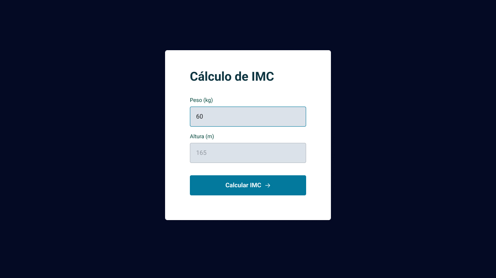
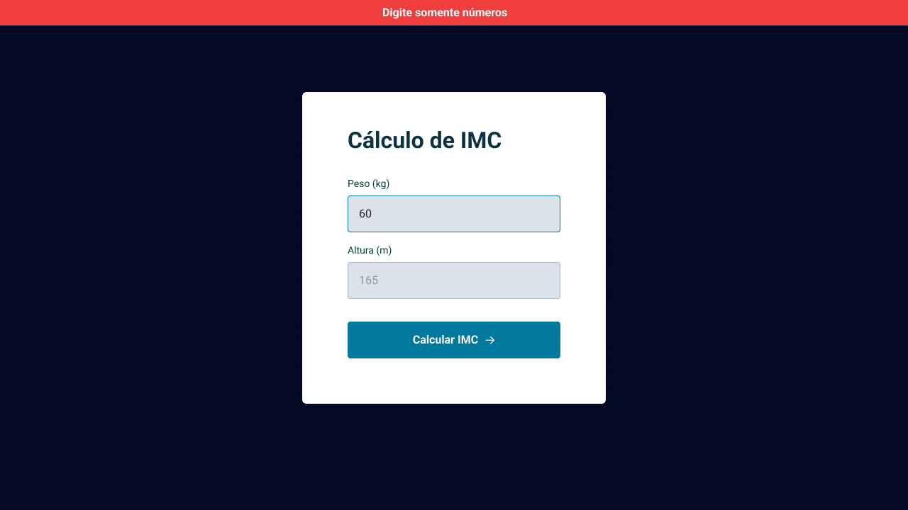

<h1 align="center">Calculadora de IMC</h1>

  

  

  

## 🚀 Tecnologias

Esse projeto foi desenvolvido com as seguintes tecnologias:

- HTML
- CSS
- JavaScript

## 💻 Projeto

Um simples app de calculadora de IMC, visando praticar e revisar ES6 e módulos do JS.

---

Feito com ♥ by Cleber-Risu
